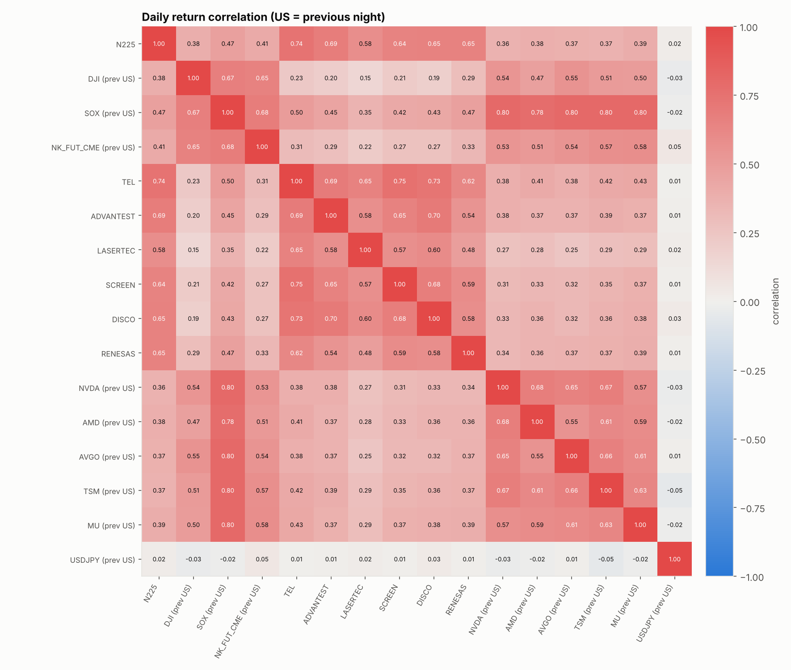
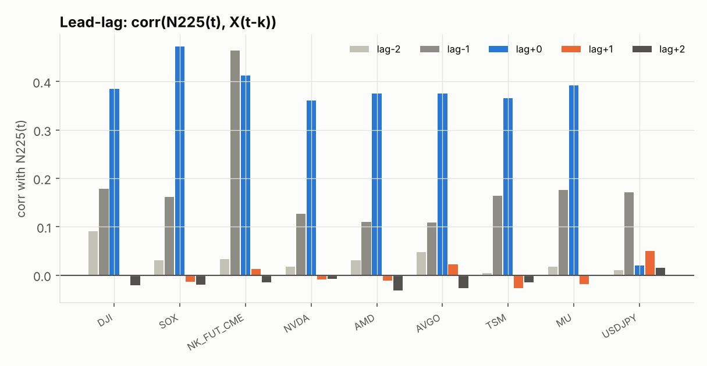
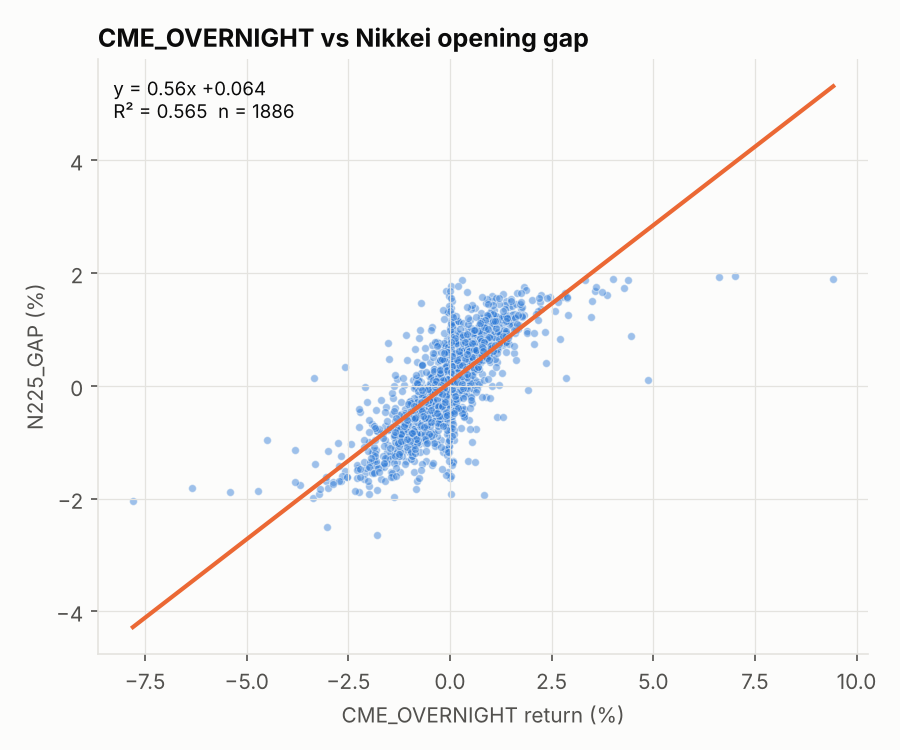
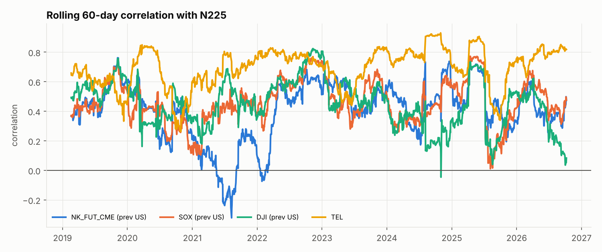

# 日経平均・先物・時間外・半導体株・SOX・ダウ 相関分析レポート

- 期間: 2019-01-07 〜 2026-10-08（日本の営業日 1,891 日）
- リターン: 日次の対数リターン
- **時差の扱い**: 米国銘柄・CME先物は「その日の東京寄付き前に終わった直近セッション」（＝前夜）の値を対応させています。表中の `(prev US)` はこの意味です。

## 対象銘柄

| キー | 名称 | 市場 |
|---|---|---|
| N225 | 日経平均株価 | 東京 |
| DJI | NYダウ平均 | 米国/CME(前夜) |
| SOX | フィラデルフィア半導体株指数(SOX) | 米国/CME(前夜) |
| NK_FUT_CME | 日経225先物(CME・円建て) | 米国/CME(前夜) |
| TEL | 東京エレクトロン | 東京 |
| ADVANTEST | アドバンテスト | 東京 |
| LASERTEC | レーザーテック | 東京 |
| SCREEN | SCREENホールディングス | 東京 |
| DISCO | ディスコ | 東京 |
| RENESAS | ルネサスエレクトロニクス | 東京 |
| NVDA | エヌビディア | 米国/CME(前夜) |
| AMD | AMD | 米国/CME(前夜) |
| AVGO | ブロードコム | 米国/CME(前夜) |
| TSM | TSMC(ADR) | 米国/CME(前夜) |
| MU | マイクロン | 米国/CME(前夜) |
| USDJPY | ドル円 | 米国/CME(前夜) |

## 1. 相関行列

## 2. 日経平均(N225)との相関ランキング

| key | name | corr | n | p_value |
|---|---|---|---|---|
| TEL | 東京エレクトロン | 0.738 | 1891 | 0.000 |
| ADVANTEST | アドバンテスト | 0.686 | 1891 | 0.000 |
| RENESAS | ルネサスエレクトロニクス | 0.654 | 1891 | 3.07e-308 |
| DISCO | ディスコ | 0.651 | 1891 | 1.80e-303 |
| SCREEN | SCREENホールディングス | 0.644 | 1891 | 1.70e-293 |
| LASERTEC | レーザーテック | 0.579 | 1891 | 3.36e-209 |
| SOX | フィラデルフィア半導体株指数(SOX) | 0.472 | 1891 | 6.67e-120 |
| NK_FUT_CME | 日経225先物(CME・円建て) | 0.412 | 1891 | 3.52e-86 |
| MU | マイクロン | 0.392 | 1891 | 2.00e-76 |
| DJI | NYダウ平均 | 0.385 | 1891 | 2.68e-73 |
| AMD | AMD | 0.375 | 1891 | 2.18e-69 |
| AVGO | ブロードコム | 0.375 | 1891 | 4.37e-69 |
| TSM | TSMC(ADR) | 0.365 | 1891 | 2.98e-65 |
| NVDA | エヌビディア | 0.361 | 1891 | 2.45e-63 |
| USDJPY | ドル円 | 0.020 | 1891 | 0.387 |

## 3. ラグ相関（どちらが先に動くか）

`lag+k` = 日経平均(t) と X(t-k) の相関。米国銘柄では **lag+0 が前夜の米国市場**、**lag-1 が東京引け後の米国市場**（東京→NYの波及）、lag+1 は前々夜です。

| key | lag-2 | lag-1 | lag+0 | lag+1 | lag+2 |
|---|---|---|---|---|---|
| DJI | 0.090 | 0.178 | 0.385 | -5.82e-04 | -0.022 |
| SOX | 0.031 | 0.161 | 0.472 | -0.014 | -0.019 |
| NK_FUT_CME | 0.033 | 0.464 | 0.412 | 0.012 | -0.015 |
| NVDA | 0.018 | 0.127 | 0.361 | -0.009 | -0.007 |
| AMD | 0.031 | 0.110 | 0.375 | -0.011 | -0.032 |
| AVGO | 0.047 | 0.109 | 0.375 | 0.022 | -0.027 |
| TSM | 0.004 | 0.164 | 0.365 | -0.027 | -0.014 |
| MU | 0.018 | 0.176 | 0.392 | -0.019 | -0.001 |
| USDJPY | 0.010 | 0.171 | 0.020 | 0.050 | 0.015 |
| TEL | 0.013 | -0.025 | 0.738 | -0.013 | -0.002 |
| ADVANTEST | 9.78e-04 | -0.038 | 0.686 | -0.028 | -0.021 |
| LASERTEC | 0.039 | -0.018 | 0.579 | -0.031 | 0.020 |
| SCREEN | 0.015 | -0.006 | 0.644 | -0.002 | -0.006 |
| DISCO | -0.011 | -0.006 | 0.651 | -0.062 | 0.015 |
| RENESAS | 0.006 | 0.005 | 0.654 | -0.002 | 0.012 |

## 4. 時間外の動きと日経平均の「寄付きギャップ」「日中値動き」

日経平均の日次リターンを **ギャップ(前日終値→寄付)** と **日中(寄付→終値)** に分解し、前夜の米国市場・CME先物（時間外）がどちらを説明しているかを見ます。

| X(prev US) | target | corr | 方向一致率 | n | p_value |
|---|---|---|---|---|---|
| DJI | N225_GAP | 0.574 | 0.710 | 1891 | 1.99e-203 |
| DJI | N225_INTRADAY | 0.109 | 0.502 | 1891 | 1.84e-06 |
| SOX | N225_GAP | 0.610 | 0.735 | 1891 | 8.63e-246 |
| SOX | N225_INTRADAY | 0.205 | 0.513 | 1891 | 7.38e-20 |
| NK_FUT_CME | N225_GAP | 0.524 | 0.690 | 1891 | 9.37e-158 |
| NK_FUT_CME | N225_INTRADAY | 0.186 | 0.514 | 1891 | 1.90e-16 |
| NVDA | N225_GAP | 0.494 | 0.673 | 1891 | 1.56e-134 |
| NVDA | N225_INTRADAY | 0.136 | 0.526 | 1891 | 2.71e-09 |
| AMD | N225_GAP | 0.470 | 0.670 | 1891 | 1.15e-118 |
| AMD | N225_INTRADAY | 0.175 | 0.523 | 1891 | 1.23e-14 |
| AVGO | N225_GAP | 0.495 | 0.690 | 1891 | 1.97e-135 |
| AVGO | N225_INTRADAY | 0.155 | 0.521 | 1891 | 9.77e-12 |
| TSM | N225_GAP | 0.466 | 0.671 | 1891 | 1.15e-115 |
| TSM | N225_INTRADAY | 0.164 | 0.514 | 1891 | 4.95e-13 |
| MU | N225_GAP | 0.476 | 0.677 | 1891 | 2.55e-122 |
| MU | N225_INTRADAY | 0.193 | 0.517 | 1891 | 1.05e-17 |
| USDJPY | N225_GAP | 0.049 | 0.516 | 1891 | 0.034 |
| USDJPY | N225_INTRADAY | -0.009 | 0.491 | 1891 | 0.699 |
| CME_OVERNIGHT | N225_GAP | 0.751 | 0.804 | 1886 | 0.000 |
| CME_OVERNIGHT | N225_INTRADAY | 0.354 | 0.546 | 1886 | 1.40e-60 |

`CME_OVERNIGHT` = CME日経先物の直近終値 ÷ 前日の日経平均終値（直近20日の中央値ベーシスを控除）＝東京市場が閉まっている間（時間外）に先物が織り込んだ変動の推定値です。

## 5. 重回帰: 日経平均リターンを前夜の米国市場で説明する

**N225 ~ SOX + DJI**  (R² = 0.232, 自由度調整済R² = 0.231, n = 1891)

| 説明変数 | 係数(β) | t値 |
|---|---|---|
| const | 0.0003 | 1.0910 |
| SOX | 0.2245 | 14.3634 |
| DJI | 0.1482 | 4.6744 |

**N225 ~ SOX + DJI + USDJPY**  (R² = 0.233, 自由度調整済R² = 0.232, n = 1891)

| 説明変数 | 係数(β) | t値 |
|---|---|---|
| const | 0.0003 | 1.0310 |
| SOX | 0.2245 | 14.3709 |
| DJI | 0.1494 | 4.7137 |
| USDJPY | 0.0799 | 1.6219 |

**日本の半導体株 ~ 前夜のSOX（β = SOXが1%動いた時の平均的な反応）**

| key | name | beta_SOX | R2 | n |
|---|---|---|---|---|
| TEL | 東京エレクトロン | 0.567 | 0.249 | 1891 |
| ADVANTEST | アドバンテスト | 0.617 | 0.200 | 1891 |
| LASERTEC | レーザーテック | 0.517 | 0.124 | 1891 |
| SCREEN | SCREENホールディングス | 0.541 | 0.177 | 1891 |
| DISCO | ディスコ | 0.538 | 0.183 | 1891 |
| RENESAS | ルネサスエレクトロニクス | 0.636 | 0.225 | 1891 |

## 6. ローリング相関（60営業日）

相関の強さは時期によって変わります。直近の関係性を確認してください。

直近値: NK_FUT_CME = 0.48, SOX = 0.47, DJI = 0.08, TEL = 0.82

## 7. 年別の相関

| year | NK_FUT_CME | SOX | DJI | NVDA | TEL |
|---|---|---|---|---|---|
| 2019 | 0.498 | 0.505 | 0.560 | 0.448 | 0.595 |
| 2020 | 0.383 | 0.381 | 0.339 | 0.335 | 0.720 |
| 2021 | 0.063 | 0.401 | 0.424 | 0.308 | 0.680 |
| 2022 | 0.456 | 0.610 | 0.647 | 0.580 | 0.764 |
| 2023 | 0.493 | 0.452 | 0.453 | 0.357 | 0.668 |
| 2024 | 0.474 | 0.421 | 0.238 | 0.217 | 0.845 |
| 2025 | 0.518 | 0.582 | 0.559 | 0.452 | 0.685 |
| 2026 | 0.412 | 0.466 | 0.327 | 0.307 | 0.787 |

## 読み方の注意

- 相関は因果関係を意味しません。共通要因（金利・為替・リスク選好など）で同時に動いている可能性があります。
- CME先物は東京の取引時間中にも取引されるため、`NK_FUT_CME`(前夜終値の前日比) には東京時間の動きも含まれます。純粋な時間外の動きは `CME_OVERNIGHT` を参照してください。
- 日経平均の「始値」は 9:00 時点でまだ寄り付いていない銘柄を前日終値で計算するため、前夜の動きを織り込みきれません。その残りが `N225_INTRADAY` と前夜の米国市場との正の相関として現れます（個別株は寄付きが実際の約定値なので、この現象はほとんど出ません）。
- `NK_FUT_CME` と `USDJPY` の日足は東京の取引時間も含むため、lag-1（同じ日付の値）でも相関が出ます。
- Yahoo Finance の `NIY=F` は多くの日が出来高0・四本値が同じ足（清算値のみ）で、通常の足より時間外指標としての精度が落ちます。終値の記録時刻も年によって一定でないようで（例: 2021年は前夜の値より同じ日付の値の方が日経平均と強く連動）、CME先物を使った結果は SOX・ダウを使った結果より割り引いて見てください。
- p値は正規近似です。日次リターンは裾が厚いため、目安として扱ってください。